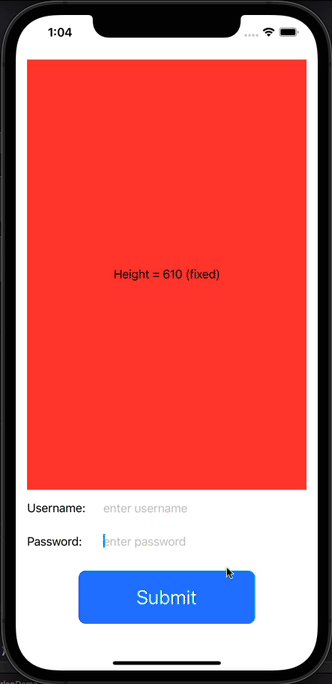

# Handle Keyboard Overlapping Fields
Adding support for avoiding the on-screen keyboard hiding important UI.

Prior to iOS 14, when the on-screen keyboard is displayed it can obscure text fields or other important content.
However, with iOS 14 the system now provides automatic built-in support for keyboard avoidance:


When the keyboard activates the screen contents *appear* to move up. However, what's actually happening is that 
iOS is compressing any view elements that it can to make space for the keyboard:


```swift
struct ContentView: View {
    
    @State private var username = ""
    @State private var password = ""
    
    var body: some View {
        
        VStack(alignment: .leading) {
            
            // Introduce a "squishable" view element to show how iOS14 will compress space
            // if possible when the keyboard's displayed
            GeometryReader { geometry in
                Color.red
                    .overlay(Text("Height = \(Int(geometry.size.height))"))
            }
            
            Spacer()
            
            HStack {
                Text("Username:").frame(width: 100, height: 35, alignment: .leading)
                TextField("enter username", text: $username)
            }
            
            HStack {
                Text("Password:").frame(width: 100, height: 35, alignment: .leading)
                SecureField("enter password", text: $password)
            }
            
            HStack {
                
                Button(action: {
                    
                    print("Username = \(username)")
                    print("Password = \(password)")
                    
                }, label: {
                    Text("Submit")
                        .font(.title)
                        .frame(width: 250, height: 75, alignment: .center)
                        .background(Color.blue)
                        .cornerRadius(10)
                        .foregroundColor(.white)
                        .padding()
                })
            }.frame(maxWidth: .infinity)
        }
        .padding()
    }
}
```

If we make the color block of fixed size then iOS moves the view up, pushing the color block off the top of the screen:

```swift
struct ContentView: View {
    var body: some View {   
        VStack(alignment: .leading) {
            Color.red
                .overlay(Text("Height = 610 (fixed)"))
                .frame(height: 610)  // Fixed height
```


Another easy way to support keyboard avoidance is to place your content inside a `ScrollView`, rather than a `VStack`.
Using this approach iOS automatically scrolls the view correctly to make sure the view with focus is visible:

```swift
struct ContentView: View {
    var body: some View {
        ScrollView {                 // Use a ScrollView
            Color.red
                .overlay(Text("Height = 610 (fixed)"))
                .frame(height: 610)  // Fixed
```



# Support in iOS13
If you want to support keyboard avoidance in iOS 13 then you need to subscribe to the `UIApplication.keyboardWillShowNotification` and 
`UIApplication.keyboardWillHideNotification` notifcations and adjust the layout of your view accordingly. 

The essential idea is to listen for keyboard hide/show notifications and then add/remove padding to your view's container based on the height of the keyboard:

```swift
import UIKit
import Combine

class ContentViewModel: ObservableObject {
    
    @Published var keyboardHeight: Int = 0
    
    var showKeyboard: AnyCancellable?
    var hideKeyboard: AnyCancellable?

    init() {
        showKeyboard = NotificationCenter.default
            .publisher(for: UIResponder.keyboardWillShowNotification)
            .sink(receiveValue: { notification in
                if let userInfo = notification.userInfo,
                   let kbRect = userInfo[UIResponder.keyboardFrameEndUserInfoKey] as? CGRect {
                    self.keyboardHeight = Int(kbRect.height)
                }
            })
        
        hideKeyboard = NotificationCenter.default
            .publisher(for: UIResponder.keyboardWillHideNotification)
            .sink(receiveValue: { notification in
                self.keyboardHeight = 0
            })
    }
}

struct ContentView: View {
    @StateObject var viewModel = ContentViewModel()
    
    var body: some View {
        ScrollView {
            Color.red
                .overlay(Text("Height = 610 (fixed)\nKeyboard height = \(viewModel.keyboardHeight)"))
                .frame(height: 610)  // Fixed
            
            Spacer()
        }
        .padding(.bottom, CGFloat(viewModel.keyboardHeight))
    }
}
```

However, it's recommended to use one of the available open source solutions such as:
* https://www.vadimbulavin.com/how-to-move-swiftui-view-when-keyboard-covers-text-field/
* https://github.com/V8tr/KeyboardAvoidanceSwiftUI/blob/master/KeyboardAvoidanceSwiftUI/ContentView.swift
